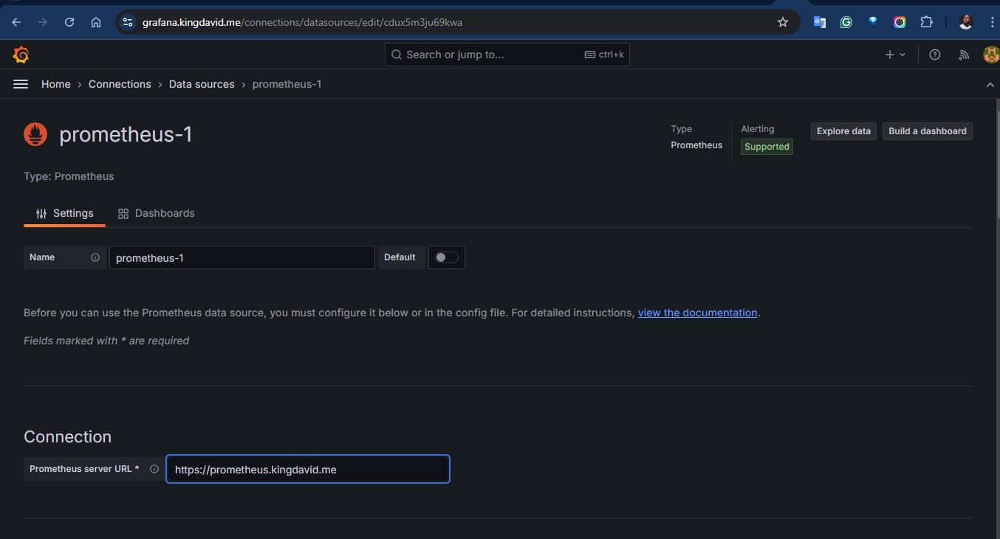

# Microservices Kubernetes Deployment
This project demonstrates a microservices-based architecture application deployed on Kubernetes using Infrastructure as Code (IaC).

## Overview
The application is hosted on AWS's Kubernetes service (EKS) and is accessible via the subdomain `socks.kingdavid.me`, secured with HTTPS. Prometheus and Grafana are utilized for logging and monitoring purposes.
Helm will be employed as our package manager to install Nginx-Ingress co
Each component of the application runs in its own Docker container, following a microservices architecture, which enhances the efficiency and scalability of the application.  
  
## Prerequisites  
The following need to be installed and configured before starting deployment
- AWS CLI  
- Terraform  
- Kubernetes CLI  
- Helm

## Deployment
The major parts of the deployment process can be automated through the use of a bash script for faster deployment and to avoid errors, however some steps need to be taken before executing the scrips, these steps are:
- Create helm chart using the command `helm create sock-shop`, This will create an helm chart, create a manifest directory and copy all your kubernete manifest files into it.  
- Create the `ingress.yaml`, `cluster-issuer.yaml` and `certificate.yaml` files inside the sock-shop directory

### Step 1: Infrastructure Setup and Application Deployment
Execute the first script [auto-deploy-1.sh](auto-deploy-1.sh). This script performs the following tasks:

- Creates all necessary AWS infrastructure using Terraform.
- Deploys the application components.
- Installs essential tools such as Ingress Controller, Certificate Manager, Prometheus, Grafana and Prometheus alertmanager.  
### Step 2: Confirm Your Deployments  
Run the following commands to confirm to confirm your pods running as well as see the services and if your certificate is ready.  
- To check the running pods 
`kubectl get pods`
  
- To check services  
`kubectl get svc`
  
- To check ingress  
`kubectl get ingress`  
  
- To check certificate status  

### Step 2: DNS Configuration
After the initial deployment, log in to your AWS Management Console:  
- Create an A record for your subdomain `socks.kingdavid.me`,`grafana.kingdavid.me` and `prometheus.kingdavid.me` in your AWS Route53 hosted zone using the Classic Elastic Load Balancer endpoint generated, this load balancer was created when we installed nginx-ingress controller on line 25 of our bash script.
- After a minute or two, we should have a secure access to our deployment as shown in the image below  

> **NOTES:**
>
> I noticed the cerificate does not get issued untill i create an A record for the domain as stated in step 2 above

  
## For Grafana
Grafana is utilized as our monitoring tools to check the health of our pods and know when any of it is failing, restarting or running out of resources. Grafana was deployed into our cluster when we added and installed the prometheus package (line 44-46) of our first script. After the deployment we can access the grafana UI from `grafana.kingdavid.me` as configured in our `ingress,yaml` file. We will do the following on the UI  
- Set prometheus as our Data source  
  
- Create a dashboad to display our monitoring, I import a dashboard using the ID `18283` 
  
Here is what the dashboard looks like 

## For Prometheus  
Here is what the prometheus UI looks like.

